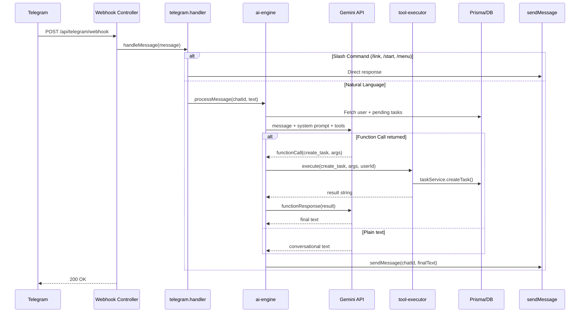

# AI Task Operations Assistant — Phase 1 Implementation Plan

## Problem

`telegram.poller.ts` was deleted (build broken). The old flow was rigid commands (`/add`, `/start`, `/menu`). We need to replace it with an AI-powered natural language engine using Gemini function-calling. Phase 1 supports 3 tools: `create_task`, `reschedule_task`, `get_tasks`.

## Current State

| Component | Status |
|---|---|
| `telegram.poller.ts` | ❌ **Deleted** — build broken |
| `telegram.controller.ts` | ❌ **Broken import** from deleted file |
| `gemini.service.ts` | Exists, no tool-calling |
| `task.service.ts` | Full CRUD: `createTask`, `getTasksByUser`, `getTaskById`, `updateTask`, `deleteTask` |
| `telegram.service.ts` | `sendMessage()` works, has debug traces |
| `conversation.service.ts` | Orphaned (was used by deleted file) |

---

## Proposed Changes

### Telegram Handler (replaces deleted telegram.poller.ts)

#### [NEW] [telegram.handler.ts](file:///b:/Ai-MOM/backend/src/services/telegram.handler.ts)

Replaces the deleted `telegram.poller.ts`. Contains:

- **`handleMessage(message)`** — routes incoming messages:
  - `/link` → existing `linkService.linkTelegramAccount()`
  - `/start` → existing `navigationService.sendMainMenu()`
  - `/menu` → existing `navigationService.sendMainMenu()`
  - **Everything else** → `aiEngine.processMessage(chatId, text)`
- **`handleCallbackQuery(callback)`** — preserved from old file:
  - `SNOOZE_*` → snooze logic (direct Prisma update)
  - `DONE_*` → `navigationService.handleDoneCallback()`
  - `NAV_*` → `navigationService.handleNavigationCallback()`

This file exports the same function names (`handleMessage`, `handleCallbackQuery`) so `telegram.controller.ts` only needs an import path change.

---

### AI Engine

#### [NEW] [ai-engine.service.ts](file:///b:/Ai-MOM/backend/src/services/ai-engine.service.ts)

Core orchestrator. Contains:

**System Prompt** (stored as const string):
- Persona: AI Task Operations Assistant
- Timezone: Asia/Kolkata assumed, output ISO 8601 with offset
- Time defaults: morning=09:00, afternoon=15:00, evening=18:00, tonight=21:00, no time=09:00
- Confidence rules: high/medium/low
- Ambiguity: ask clarification instead of guessing
- Context: user's pending tasks injected per call

**Gemini Tool Definitions** (3 tools):

```
create_task:
  parameters:
    title: string (required)
    due_date: string (required, ISO 8601)
    confidence: enum [high, medium, low] (required)
    description: string (optional)
    priority: enum [LOW, MEDIUM, HIGH] (optional)
    estimated_minutes: integer (optional, default 30)

reschedule_task:
  parameters:
    task_id: string (required)
    new_due_date: string (required, ISO 8601)
    confidence: enum [high, medium, low] (required)

get_tasks:
  parameters:
    date_filter: string (optional, YYYY-MM-DD)
    keyword: string (optional)
    confidence: enum [high, medium, low] (required)
```

**`processMessage(chatId, userText)`** flow:
1. Look up user by `telegramChatId`
2. Fetch user's pending tasks (for context injection + task_id resolution)
3. Build contents array: system prompt + user context + user message
4. Call Gemini with tools in **AUTO** mode
5. If response contains a function call → execute via `toolExecutor` → feed result back to Gemini → get final text
6. If response is plain text → send directly
7. Send final text to chatId via `sendMessage()`

---

### Tool Executor

#### [NEW] [tool-executor.service.ts](file:///b:/Ai-MOM/backend/src/services/tool-executor.service.ts)

Map of tool name → async executor function:

| Tool | Executes | Returns |
|---|---|---|
| `create_task` | `taskService.createTask(userId, data)` | Confirmation string with task title + due date formatted in IST |
| `reschedule_task` | `taskService.updateTask(userId, taskId, { dueDate })` | Confirmation string with new date in IST |
| `get_tasks` | `taskService.getTasksByUser(userId)` + filter | Formatted task list string |

Validation before execution:
- `create_task`: verify `due_date` is valid ISO, is in the future
- `reschedule_task`: verify `task_id` exists and belongs to user
- `get_tasks`: verify `date_filter` is valid date if provided

---

### Existing File Modifications

#### [MODIFY] [telegram.controller.ts](file:///b:/Ai-MOM/backend/src/controllers/telegram.controller.ts)

Single line change — fix broken import:

```diff
-import { handleMessage, handleCallbackQuery } from "../services/telegram.poller";
+import { handleMessage, handleCallbackQuery } from "../services/telegram.handler";
```

#### [MODIFY] [gemini.service.ts](file:///b:/Ai-MOM/backend/src/services/gemini.service.ts)

Add export of the raw `genAI` instance and model creation helper for the AI engine to use with tool-calling config:

```typescript
export { genAI };  // Export for ai-engine to create tool-calling model
```

Existing `parseTaskFromText` and `generateGeminiResponse` remain untouched.

---

## What Is NOT Changed

- ✅ Reminder cron (`reminder.job.ts`, `reminder.service.ts`)
- ✅ `sendReminderNotification` flow
- ✅ Snooze callback handling (preserved in new handler)
- ✅ Navigation callbacks (preserved in new handler)
- ✅ Webhook route registration (`app.ts`)
- ✅ Prisma schema (no migration)
- ✅ `task.service.ts` CRUD functions

---

## Architecture Flow



---

## Verification Plan

### Build Check
```bash
cd b:\Ai-MOM\backend && npm run build
```
Must compile with zero errors.

### Manual Telegram Tests

| Test | Input | Expected |
|---|---|---|
| Create task | "Buy groceries tomorrow at 5pm" | Creates task, confirms with title + IST time |
| Create (no time) | "Finish the report tomorrow" | Creates with 09:00 IST default, confidence medium |
| List tasks | "Show my tasks" | Lists pending tasks |
| List filtered | "What do I have tomorrow?" | Shows tomorrow's tasks only |
| Reschedule | "Move \<task\> to Friday 3pm" | Updates due date, confirms |
| Ambiguous | "Reschedule it" (no prior context) | Asks clarification |
| Slash commands | `/start`, `/menu`, `/link` | Still work as before |
| Gibberish | "asdfgh" | Conversational response, no tool call |

### Existing Functionality
- Snooze buttons on reminder notifications still work
- Done/Navigation callbacks still work
- Reminder cron still fires correctly
